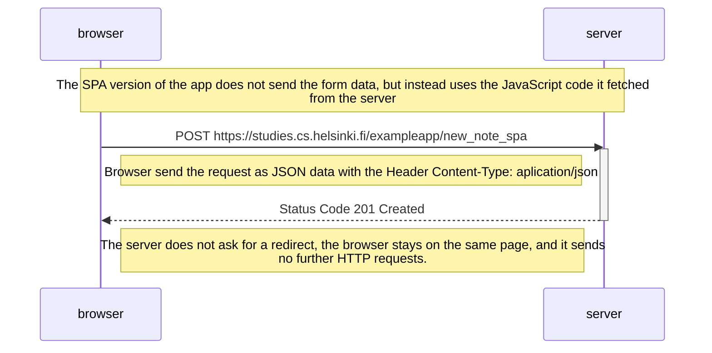

```mermaid
sequenceDiagram
participant browser
participant server

Note over browser,server: The SPA version of the app does not send the form data, but instead uses the JavaScript code it fetched<br> from the server

browser->>server: POST https://studies.cs.helsinki.fi/exampleapp/new_note_spa
activate server

Note right of browser: Browser send the request as JSON data with the Header Content-Type: aplication/json

server-->>browser: Status Code 201 Created
deactivate server

Note left of server: The server does not ask for a redirect, the browser stays on the same page, and it sends<br> no further HTTP requests.

```